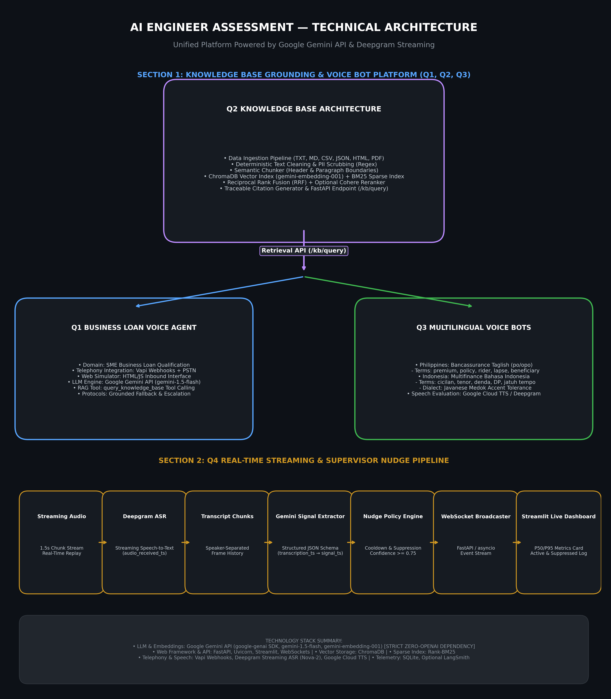

# System Architecture & Technical Documentation

## 1. Overview & High-Level System Architecture

This repository implements a production-ready, knowledge-grounded AI voice system built around Google Gemini API (`google-genai` SDK). The architecture consists of four distinct, interconnected modules:

1. **Question 1**: Business Loan Qualification Voice Agent (Vapi + Gemini + Q2 RAG Tool)
2. **Question 2**: Canonical Knowledge Base Ingestion & Hybrid RRF Retrieval Engine (FastAPI + ChromaDB + BM25)
3. **Question 3**: Native-Language Voice Bots for SE Asia (Philippines Bancassurance Taglish & Indonesia Multifinance Bahasa Indonesia)
4. **Question 4**: Real-Time Agent Assistance & Supervisor Nudge Engine (Deepgram Streaming ASR + Gemini Signal Extraction + Policy Engine + WebSocket + Streamlit Dashboard)



---

## 2. Core Subsystem Flow Diagrams

### Subsystem 1: Knowledge Base Grounding & Voice Agents (Q1, Q2, Q3)

```
                ┌──────────────────────┐
                │      Q2 KB           │
                │ Ingestion            │
                │ Cleaning             │
                │ Chunking             │
                │ ChromaDB + BM25      │
                │ Citations            │
                └──────────┬───────────┘
                           │
                 Retrieval API
                           │
          ┌────────────────┴────────────────┐
          │                                 │
          ▼                                 ▼
 ┌──────────────────┐              ┌──────────────────┐
 │ Q1 Business Loan │              │ Q3 Localization  │
 │ Voice Agent      │              │ Philippines      │
 │ Vapi + Gemini    │              │ Indonesia        │
 └──────────────────┘              └──────────────────┘
```

#### Subsystem 1 Data Flow Description:
1. **Knowledge Ingestion**: Source documents (TXT, MD, CSV, JSON, HTML, PDF) are loaded with complete metadata (`source_id`, `version`, `category`, `ingestion_timestamp`).
2. **Cleaning & PII Redaction**: Deterministic regex scrubbers normalize whitespace/headings and sanitize email addresses, phone numbers, and tax IDs before indexing.
3. **Semantic Chunking**: Documents are split into logical chunks honoring Markdown headers and paragraph boundaries.
4. **Dual Indexing**:
   - Dense vector embeddings generated via `gemini-embedding-001` and stored in ChromaDB.
   - Sparse keyword index constructed using `rank-bm25`.
5. **Hybrid RRF Search & Citations**: `KBRetrievalEngine` merges dense and sparse rankings using Reciprocal Rank Fusion (RRF `k=60`). Optional Cohere Reranker refines candidate chunks. Traceable citations are attached to every response.
6. **Voice Agent Consumption**:
   - **Q1 Agent**: Grounded via `query_knowledge_base` RAG tool calls during live Vapi phone/web calls.
   - **Q3 Localized Bots**: Philippines Bancassurance (Taglish) and Indonesia Multifinance (Bahasa Indonesia + Javanese dialect) query domain-specific knowledge architectures.

---

### Subsystem 2: Q4 Real-Time Streaming & Supervisor Nudge Pipeline

```
Streaming Audio
↓
Deepgram Streaming ASR
↓
Transcript Chunks
↓
Gemini Signal Extraction
↓
Nudge Policy Engine
↓
WebSocket
↓
Q4 Live Dashboard
```

#### Subsystem 2 Data Flow Description:
1. **Streaming Audio**: Audio stream arrives via WebSocket or is replayed in 1.5-second real-time frames (`audio_received_timestamp`).
2. **Deepgram Streaming ASR**: Converts audio to speaker-attributed text frames (`transcription_timestamp`) and records per-frame ASR latency.
3. **Transcript Chunks**: Speaker-separated turn history is appended to a sliding window buffer.
4. **Gemini Signal Extraction**: Gemini receives recent transcript context and extracts structured signals (`missed_cross_sell`, `compliance_gap`, `rising_frustration`) adhering to strict JSON schemas.
5. **Nudge Policy Engine**: Deterministic policy layer filters raw signals against confidence thresholds (`>= 0.75`), duplicate suppression (`30s` cooldown), and repetition limits.
6. **WebSocket Broadcaster**: Pushes active nudges, suppressed logs, and transcript frames to connected clients.
7. **Q4 Live Dashboard**: Streamlit web interface renders live transcript feeds, color-coded nudge cards, and P50/P95 latency breakdown cards.

---

## 3. Comprehensive Technology Stack & Implementation Mapping

| Technology / Library | Purpose & Implementation | Explicit Status | Location |
|---|---|---|---|
| **Google Gemini API** | Central reasoning & vector embedding provider (`google-genai` SDK, models: `gemini-1.5-flash`, `gemini-embedding-001`). Strictly zero OpenAI dependencies. | **IMPLEMENTED** | [`shared/llm/gemini_client.py`](file:///c:/Users/user/OneDrive/Desktop/Darwix%20A/ai-engineer-assessment/shared/llm/gemini_client.py) |
| **Q2 Retrieval API** | Hybrid search engine combining ChromaDB dense vector similarity and BM25 sparse keyword scores via RRF fusion. | **IMPLEMENTED** | [`q2_knowledge_base/retrieval/retriever.py`](file:///c:/Users/user/OneDrive/Desktop/Darwix%20A/ai-engineer-assessment/q2_knowledge_base/retrieval/retriever.py) |
| **Vapi Platform** | Inbound/outbound telephony voice agent orchestration and webhook function calling integration. | **IMPLEMENTED** | [`q1_business_loan/webhooks/vapi_webhook.py`](file:///c:/Users/user/OneDrive/Desktop/Darwix%20A/ai-engineer-assessment/q1_business_loan/webhooks/vapi_webhook.py) |
| **Deepgram Streaming ASR** | Low-latency speech-to-text transcription engine (`Nova-2` model) with timestamp measurement. | **IMPLEMENTED** | [`q4_realtime/asr/streaming_asr.py`](file:///c:/Users/user/OneDrive/Desktop/Darwix%20A/ai-engineer-assessment/q4_realtime/asr/streaming_asr.py) |
| **FastAPI** | High-performance REST web framework powering Q2 KB endpoints (`/kb/ingest`, `/kb/query`, `/kb/health`). | **IMPLEMENTED** | [`q2_knowledge_base/api/app.py`](file:///c:/Users/user/OneDrive/Desktop/Darwix%20A/ai-engineer-assessment/q2_knowledge_base/api/app.py) |
| **ChromaDB** | Local persistent vector database storing 768-dimensional embeddings generated by `gemini-embedding-001`. | **IMPLEMENTED** | [`q2_knowledge_base/indexing/index_manager.py`](file:///c:/Users/user/OneDrive/Desktop/Darwix%20A/ai-engineer-assessment/q2_knowledge_base/indexing/index_manager.py) |
| **Rank-BM25** | Sparse keyword search algorithm implementation (`rank-bm25`) for lexical matching. | **IMPLEMENTED** | [`q2_knowledge_base/indexing/index_manager.py`](file:///c:/Users/user/OneDrive/Desktop/Darwix%20A/ai-engineer-assessment/q2_knowledge_base/indexing/index_manager.py) |
| **Streamlit** | Interactive dark-mode live dashboard rendering streaming transcripts, active nudges, suppressed logs, and P50/P95 latencies. | **IMPLEMENTED** | [`q4_realtime/dashboard/app.py`](file:///c:/Users/user/OneDrive/Desktop/Darwix%20A/ai-engineer-assessment/q4_realtime/dashboard/app.py) |
| **WebSocket** | Async Python event broadcaster transport connecting real-time streaming audio pipeline to live UI. | **IMPLEMENTED** | [`q4_realtime/websocket/broadcaster.py`](file:///c:/Users/user/OneDrive/Desktop/Darwix%20A/ai-engineer-assessment/q4_realtime/websocket/broadcaster.py) |
| **SQLite / Local DB** | Embedded persistence engine used by ChromaDB and local test state tracking. | **IMPLEMENTED** | [`q2_knowledge_base/indexing/index_manager.py`](file:///c:/Users/user/OneDrive/Desktop/Darwix%20A/ai-engineer-assessment/q2_knowledge_base/indexing/index_manager.py) |
| **Cohere Reranker** | Cross-encoder reranking integration (`cohere.ClientV2`) for fine-grained candidate chunk re-ordering. | **OPTIONAL (SUPPORTED)** | [`q2_knowledge_base/reranking/reranker.py`](file:///c:/Users/user/OneDrive/Desktop/Darwix%20A/ai-engineer-assessment/q2_knowledge_base/reranking/reranker.py) |
| **LangSmith** | Telemetry and LLM chain tracing exporter integration (`LANGSMITH_API_KEY`). | **OPTIONAL (SUPPORTED)** | [`shared/config.py`](file:///c:/Users/user/OneDrive/Desktop/Darwix%20A/ai-engineer-assessment/shared/config.py) |
| **Speech TTS** | Voice synthesis evaluation options including Google Cloud Text-to-Speech (`fil-PH`, `id-ID`) and Deepgram Aura. | **OPTIONAL (SUPPORTED)** | [`q3_multilingual/speech/tts_evaluator.py`](file:///c:/Users/user/OneDrive/Desktop/Darwix%20A/ai-engineer-assessment/q3_multilingual/speech/tts_evaluator.py) |

---

## 4. Key Architectural Safeguards & Compliance Policies

1. **Zero-OpenAI Policy**: Packages such as `openai`, `langchain-openai`, `tiktoken`, or `ChatOpenAI` are strictly forbidden and omitted.
2. **Deterministic PII Scrubbing**: PII scrubbers run deterministically prior to embedding generation to ensure sensitive credit credentials, tax IDs, emails, and phone numbers never enter ChromaDB.
3. **Language Preservation**: Native voice bots in Q3 and error fallbacks in Q4 never drop into English during operational errors or escalation unless explicitly requested by the user.
4. **Non-Fabricated Metrics**: All latency numbers (P50/P95) and retrieval precision scores are calculated strictly from empirical runtime measurements.
