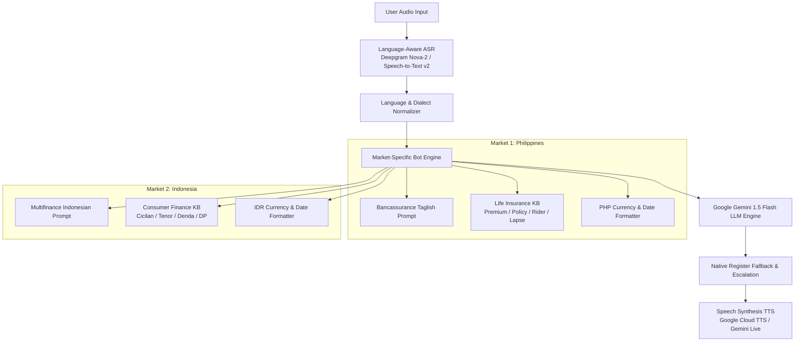

# Q3 — Native-Language Voice Bots (SE Asia: Philippines & Indonesia)

## 1. Executive Summary & Architecture

Question 3 implements two localized, culturally grounded voice bot prototypes tailored for Southeast Asian financial markets:
1. **Market 1 — Philippines**: Life Insurance / Bancassurance domain operating in natural **Taglish** (Tagalog + English code-switching) with respectful *po/opo* register.
2. **Market 2 — Indonesia**: Consumer Finance / Multifinance domain operating in **Bahasa Indonesia** (formal & colloquial + finance loanwords) with *Bapak/Ibu* honorifics and regional Javanese accent tolerance.



> [!IMPORTANT]
> **Localization vs. Translation**: These prototypes are **not** literal translations of the Q1 English Business Loan agent. They are separate domain models (Bancassurance & Multifinance) designed around local regulatory frameworks, customer behavior, and payment ecosystems.

---

## 2. Market 1 — Philippines (Bancassurance / Life Insurance)

### 2.1 Domain & Business Flow
- **Domain**: Life Insurance & Bancassurance (Partner Bank Branch Financial Advisory).
- **Core Workflows**:
  1. **Lead Qualification**: Assessing client protection needs, existing policy coverage, and budget.
  2. **Premium Reminder**: Informing clients of upcoming policy premiums (`₱2,500.00 / month`) within the 31-day grace period.
  3. **Policy Renewal & Rider Add-on**: Recommending Critical Illness or Hospitalization riders.
  4. **Bank Referral**: Arranging direct consultations with the Resident Bancassurance Specialist at partner bank branches (BDO / BPI / Metrobank).

### 2.2 Terminology Matrix
| Term | Local Context & Definition | Example Usage |
|---|---|---|
| `premium` | Buwanang o taunang bayad sa insurance policy. | *"Ang buwanang premium niyo po ay ₱2,500.00."* |
| `policy` | Ang official life insurance contract at certificate. | *"Active pa rin po ang inyong policy coverage."* |
| `beneficiary` | Ang napiling kamag-anak na makakatanggap ng claim. | *"Sino po ang nakalagay na primary beneficiary ninyo?"* |
| `rider` | Karagdagang protection benefit (Critical Illness, Disability). | *"Pwede po tayong magdagdag ng Critical Illness rider."* |
| `lapse` | Pagkakansela ng coverage matapos ang 31-day grace period. | *"Bago po mag-lapse ang policy, pwede po kayong mag-payvia GCash."* |
| `coverage` | Ang kabuuang death o sum assured benefit (₱1,000,000.00). | *"Mayroon po kayong buong ₱1,000,000.00 coverage protection."* |
| `bank referral` | Endorsement galing sa Bank Branch Manager. | *"I-refer ko po kayo sa aming Bank Financial Advisor."* |

---

## 3. Market 2 — Indonesia (Multifinance / Consumer Finance)

### 3.1 Domain & Business Flow
- **Domain**: Multifinance / Consumer Finance (Motorcycle & Car Loan Installments).
- **Core Workflows**:
  1. **Credit Lead Qualification**: Minimum Down Payment (DP 15%), tenor options (12, 24, 36, 48 months).
  2. **Installment Status & Due Date**: Monthly installment query (`angsuran` / `cicilan`) and due date (`jatuh tempo`).
  3. **Late Fee Explanation**: Explaining daily late penalty (`denda` 0.5% per day) and grace periods.
  4. **Payment Channel Options**: Virtual Account (BCA/Mandiri), Indomaret, Alfamart, QRIS, and M-Banking autodebit.

### 3.2 Terminology Matrix
| Term | Local Context & Definition | Example Usage |
|---|---|---|
| `cicilan` / `angsuran` | Tagihan pembayaran kredit bulanan. | *"Angsuran bulanan Bapak sebesar Rp 450.000,-."* |
| `tenor` | Jangka waktu pembiayaan (12, 24, 36 bulan). | *"Bapak bisa mengambil tenor 24 bulan."* |
| `denda` | Biaya keterlambatan (0.5% per hari dari angsuran). | *"Denda keterlambatan dihitung transparan 0.5% per hari."* |
| `DP` (Down Payment) | Uang muka minimal 15% OTR. | *"DP minimal kendaraan adalah 15% ya Pak."* |
| `jatuh tempo` | Tanggal paling lambat pembayaran tiap bulan. | *"Tanggal jatuh tempo angsuran adalah 15 Oktober 2026."* |
| `pembiayaan` | Fasilitas kredit konsumen resmi terdaftar OJK. | *"Fasilitas pembiayaan Nusa Finance aman dan berizin."* |

### 3.3 Regional Indonesian Accent Considerations
> [!NOTE]
> **Accent Limitation Disclosure**: We evaluate regional dialect syntax and phonetics without claiming unverified AI acoustic performance.
- **Javanese ("Medok") Dialect**:
  - *Phonetic traits*: Heavy voiced stops (`b`, `d`, `g` -> `mb`, `nd`, `ngg`).
  - *Syntax & Vocabulary*: Use of `piye` (how), `pripun`, `sampeyan` (you), `mboten` (no/not), `sik` (still), `ditunda po ora`.
  - *Parser strategy*: Post-ASR LLM intent normalization maps *"piye angsuranku sik kurang 200 ewu"* to standard installment inquiry.
- **Sundanese Dialect**:
  - *Phonetic traits*: Substitution of `f/v` with `p` (`pirtual account`).
  - *Particles*: Use of `teh`, `mah`, `pisan`.

---

## 4. Concrete Localization Examples (3 per Market)

### Philippines (Market 1)
```carousel
#### Scenario 1: Premium Reminder & Payment Channels
- **Generic Translation**: "Your premium of 2500 pesos is due on October 15. Please pay using bank account."
- **Localized Taglish**: "Magandang araw po! Ipaalala lang po namin na ang inyong policy premium na ₱2,500.00 Pesos ay due na po sa Oktubre 15, 2026. Pwede niyo pong bayaran sa GCash, Maya, o via Auto-Debit Arrangement (ADA) sa inyong BDO/BPI savings account po."
- **Localization Notes**: Incorporates warm greeting, *po/opo* register, PHP currency formatting, and local payment ecosystems (GCash, Maya, ADA).
<!-- slide -->
#### Scenario 2: Objection Handling ("Mahal ang premium")
- **Generic Translation**: "The insurance price is not expensive because it has good coverage."
- **Localized Taglish**: "Naiintindihan ko po ang inyong alalahanin sa budget. Ang maganda po sa aming VUL Life Plan, pwede po nating i-adjust ang buwanang premium down to ₱1,500.00 / buwan para pasok po sa inyong monthly savings habang buo pa rin ang inyong ₱1,000,000.00 coverage protection."
- **Localization Notes**: Empathetic customer care framing, tier adjustment, and natural banking Taglish.
<!-- slide -->
#### Scenario 3: Human Escalation Request
- **Generic Translation**: "I will connect you to a human manager now."
- **Localized Taglish**: "Naiintindihan ko po. I-transfer ko po ang inyong tawag sa aming Senior Bancassurance Specialist sa pinakamalapit na BDO/BPI partner branch para mas maasikaso po kayo nang personal. Sandali lamang po."
- **Localization Notes**: Maintains polite deferral, branch manager context, and native Taglish phrasing.
```

### Indonesia (Market 2)
```carousel
#### Scenario 1: Installment & Denda Explanation
- **Generic Translation**: "Your installment is 450000 rupiah due October 15. Late fee is 0.5 percent per day."
- **Localized Indonesian**: "Selamat siang Bapak/Ibu. Kami menginfokan bahwa angsuran pembiayaan kendaraan Bapak/Ibu sebesar Rp 450.000,- akan jatuh tempo pada 15 Oktober 2026. Untuk menghindari denda keterlambatan sebesar 0.5% per hari, pembayaran dapat dilakukan via M-Banking Virtual Account BCA/Mandiri atau di Indomaret/Alfamart terdekat ya Pak/Bu."
- **Localization Notes**: Formats Rupiah (`Rp 450.000,-`), uses *Bapak/Ibu* honorifics, and mentions VA/minimarket channels.
<!-- slide -->
#### Scenario 2: Regional Javanese Accent Dialect Objection
- **Generic Translation**: "I cannot understand your regional dialect."
- **Localized Indonesian**: "Matur nuwun Pak. Mboten menapa-napa (tidak apa-apa) Pak, kami sangat memahami maksud Bapak. Terkait angsuran yang masih kurang Rp 200.000,-, Bapak tetap dapat melakukan pembayaran parsial terlebih dahulu melalui Alfamart agar terhindar dari akumulasi denda yang lebih besar ya Pak."
- **Localization Notes**: Polite Javanese bridge (*Matur nuwun Pak, Mboten menapa-napa*) transitioning smoothly into clear Bahasa Indonesia.
<!-- slide -->
#### Scenario 3: Human Escalation Request
- **Generic Translation**: "Please wait for customer support officer."
- **Localized Indonesian**: "Baik Bapak/Ibu, saya bantu hubungkan langsung dengan Customer Service Officer (CSO) kami di kantor cabang terdekat untuk penanganan pembiayaan lebih lanjut. Mohon tunggu sebentar ya Pak/Bu."
- **Localization Notes**: Strict honorific reinforcement (*Bapak/Ibu*) and local branch CSO referral.
```

---

## 5. Voice (TTS) & ASR Evaluation

### 5.1 Voice / TTS Evaluation
- **Gemini Native Voice**: Gemini 2.5/1.5 Flash supports Native Audio streaming via the Multimodal Live WebSocket API. In REST `generate_content` mode, it outputs formatted text.
- **Production TTS Pipeline**:
  - **Philippines**: Google Cloud Speech TTS (`fil-PH-Neural2-D` or `fil-PH-Wavenet-A`).
  - **Indonesia**: Google Cloud Speech TTS (`id-ID-Wavenet-A` or `id-ID-Neural2-B`).
- **OpenAI Compliance**: OpenAI TTS is **strictly omitted**.

### 5.2 ASR (Speech-to-Text) Capabilities
- **Provider & Model**: Deepgram Nova-2 / Google Cloud Speech-to-Text v2 (Chirp).
- **Language Configurations**:
  - Philippines: `tl-PH` + `en-PH` dual-language hints for Taglish code-switching.
  - Indonesia: `id-ID` acoustic model with finance keyword boosting.
- **Known ASR Errors & Limitations**:
  - *Homophones*: Tagalog *po* recognized as *four/for* when constrained to English.
  - *Number formatting*: Spoken numbers ("dalawang libo limang daan" / "empat ratus ribu") transcribed as raw words instead of standard currency integers (`2500` / `400000`).
  - *Dialect shift*: Javanese voiced consonants causing minor phoneme confusion resolved via post-ASR LLM normalization.

---

## 6. Fallback & Escalation Language Preservation

> [!CAUTION]
> A critical failure mode in multi-lingual voice bots is reverting to English during errors or escalation.

Our architecture enforces strict language preservation:
- **Philippines Fallback**: *"Pasensya na po, medyo naputol po ang linya o hindi ko po masyadong naintindihan. Pwede niyo po bang ulitin?"*
- **Indonesia Fallback**: *"Mohon maaf Bapak/Ibu, suara kurang terdengar jelas. Bisa tolong diulangi kembali Pak/Bu?"*
- **Philippines Escalation**: *"Naiintindihan ko po. I-transfer ko po ang tawag ninyo sa aming Senior Bancassurance Specialist sa pinakamalapit na BDO/BPI branch..."*
- **Indonesia Escalation**: *"Baik Bapak/Ibu, saya bantu hubungkan langsung dengan Customer Service Officer (CSO) kami di kantor cabang terdekat..."*

---

## 7. Mandatory Compliance & Native-Speaker Review Notice

> [!WARNING]
> While these localized voice bots adhere to published financial regulations (OJK in Indonesia, Insurance Commission in Philippines), **formal deployment requires human regulatory compliance and native-speaker validation**:
> 1. **Regulatory Audit**: Verification of insurance disclosure statements (BSP / IC in PH) and consumer credit terms (OJK POJK 6/2022 in ID).
> 2. **Native Speaker Acoustic Testing**: Field-testing with native Tagalog and regional Indonesian speakers to refine acoustic model keyword weights.
