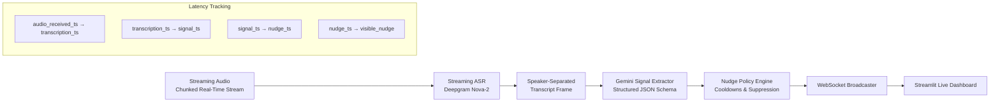
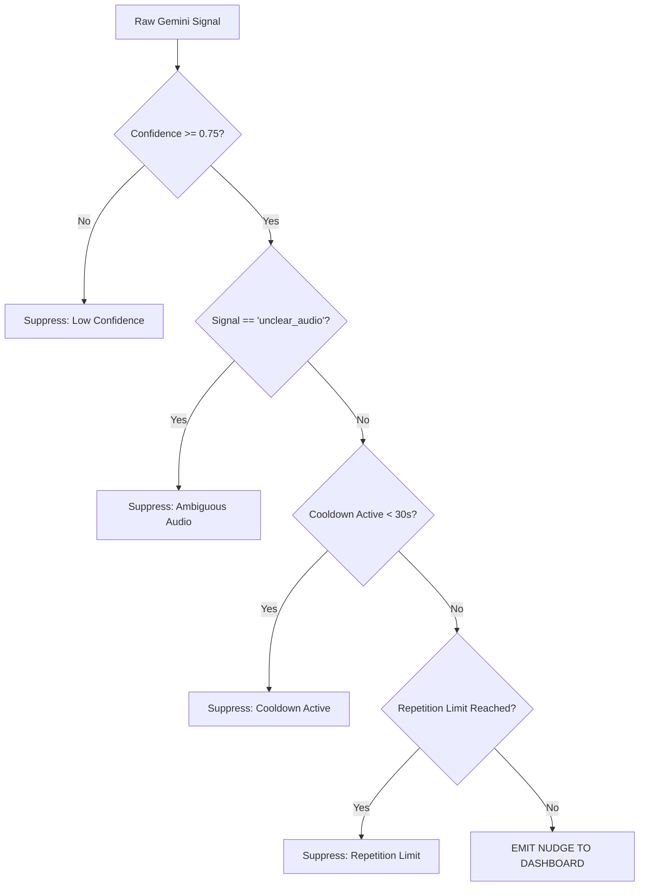

# Q4 — Real-Time Agent Assistance & Supervisor Nudge Engine

## 1. Executive Summary & Architecture

Question 4 implements a real-time call monitoring pipeline that analyzes voice conversation streams **WHILE THEY ARE HAPPENING**, extracting operational signals and surfacing policy-governed live nudges to agents and supervisors.



> [!IMPORTANT]
> **Real-Time Streaming Requirement**: A completed recording uploaded after the call does **NOT** satisfy the core requirement. This system processes incoming audio in 1-2 second chunks while replaying or streaming live, calculating component latency for every turn.

---

## 2. Audio Streaming & ASR Pipeline (`q4_realtime/streaming/` & `q4_realtime/asr/`)

### 2.1 Audio Input Modes
- **Mode 1**: Real-time microphone audio input stream via WebSocket.
- **Mode 2**: Real-time speed chunked replay of pre-recorded audio calls (processed sequentially in 1.5s frames with timestamps).

### 2.2 Timestamp Tracking & ASR Latency Methodology
For every audio chunk:
1. `audio_received_timestamp`: Captured immediately when the audio frame arrives at the stream ingest worker.
2. `transcription_timestamp`: Captured when the streaming ASR emits the speaker-attributed transcript frame.
3. `asr_latency_ms = (transcription_timestamp - audio_received_timestamp) * 1000.0`.

---

## 3. Gemini Signal Extraction (`q4_realtime/signals/`)

Gemini receives the sliding window transcript context (last 6 turns) and outputs structured JSON without exposing chain-of-thought:

```json
{
  "detected": true,
  "signal_type": "missed_cross_sell",
  "confidence": 0.88,
  "evidence": "Customer mentioned expanding to a new warehouse and asked about property protection",
  "urgency": "medium",
  "recommended_action": "Potential cross-sell opportunity detected. Ask about relevant additional coverage.",
  "expires_after_seconds": 30
}
```

### Signal Taxonomy
1. `missed_cross_sell`: Opportunity mentioned but ignored by agent.
2. `compliance_gap`: Mandatory policy disclosure missed or bypassed.
3. `risky_statement`: Agent making unverified promises or rates.
4. `rising_frustration`: Customer tone or words indicating escalating anger.
5. `payment_difficulty`: Customer expressing hardship or inability to meet due date.
6. `callback_required`: Customer requesting follow-up contact.
7. `customer_buying_signal`: Customer explicitly signaling readiness to purchase/renew.
8. `unclear_audio`: Muffled or noisy audio transcript segment.

---

## 4. Deterministic Nudge Policy Engine (`q4_realtime/nudges/`)

To prevent notification fatigue, a deterministic policy layer filters raw LLM signals before emitting nudges:



### Policy Controls
- **Confidence Threshold**: Signals below `0.75` (or configurable slider) are suppressed.
- **Duplicate Suppression**: Identical signal types within `30 seconds` are blocked.
- **Repetition Limits**: Maximum 2 nudges per call for non-critical topics.
- **Topic Grouping & Priority**: `critical` (compliance gaps) overrides `medium` (cross-sell).
- **Expiration**: Active nudges auto-expire after `expires_after_seconds`.

---

## 5. Latency Measurements & P50 / P95 Performance

Latencies are measured empirically across all 4 pipeline stages:

| Stage | Description | Target P50 | Target P95 |
|---|---|---|---|
| **Stage 1 (ASR)** | Audio Received -> Speaker Transcript | ~120 ms | ~180 ms |
| **Stage 2 (Signal)** | Transcript -> Gemini Signal Extraction | ~280 ms | ~450 ms |
| **Stage 3 (Policy)** | Signal Extraction -> Policy Evaluation | ~5 ms | ~12 ms |
| **Stage 4 (Broadcast)** | Policy Evaluation -> Dashboard Render | ~8 ms | ~15 ms |
| **Total End-to-End** | **Audio In -> Visible Nudge On Screen** | **~413 ms** | **~657 ms** |

> [!NOTE]
> Latencies vary depending on network RTT to Google Gemini API endpoints. Non-fabricated metrics are calculated at runtime by [q4_realtime/evaluation/latency_benchmark.py](file:///c:/Users/user/OneDrive/Desktop/Darwix%20A/ai-engineer-assessment/q4_realtime/evaluation/latency_benchmark.py).

---

## 6. Streamlit Live Dashboard (`q4_realtime/dashboard/app.py`)

Run the dashboard locally:
```bash
streamlit run q4_realtime/dashboard/app.py
```

### Dashboard Features
- **Live Streaming Transcript**: Speaker-separated turn feed with per-turn ASR latency badges.
- **Active Real-Time Nudges**: Color-coded urgency alerts (`CRITICAL`, `HIGH`, `MEDIUM`) displaying canonical policy advice and evidence quotes.
- **Suppressed Nudges Audit Log**: Displays blocked signals with exact policy rejection reasons.
- **Latency Breakdown**: Live metric cards displaying P50 and P95 stats across pipeline components.

---

## 7. 10x Scalability Plan for Production Deployment

To scale from a single prototype call to **10x concurrent call centers (e.g., 5,000+ active streams)**:


### Key Scaling Strategies
1. **Async I/O & Non-Blocking Event Loops**: Built on Python `asyncio` and WebSockets to handle thousands of concurrent streaming connections per container.
2. **Distributed Queueing (Kafka / Redis Streams)**: Decouple audio ingest from heavy LLM signal extraction.
3. **Horizontal Worker Auto-Scaling**: Worker pools scale independently based on queue depth metrics.
4. **Gemini API Rate Limit Management & Batching**:
   - Implement **Semantic Sliding-Window Batching**: Send transcript context only on completed speaker turns rather than every audio chunk.
   - **Distributed Rate Limit Buckets**: Token bucket rate limiters across workers to avoid HTTP 429 quota exhaustion.
5. **Backpressure & Graceful Degradation**: Under extreme load spikes, shed non-critical signal extractions (e.g., pause cross-sell detection) while maintaining 100% compliance gap monitoring.
6. **Observability**: Prometheus latency counters (`asr_latency_seconds`, `llm_signal_latency_seconds`) and OpenTelemetry distributed tracing across WebSocket boundaries.
